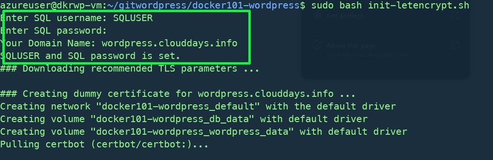
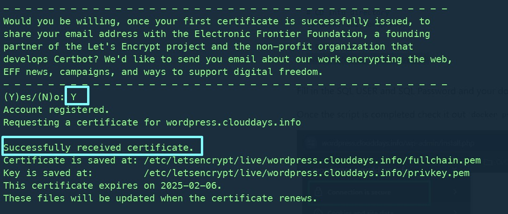
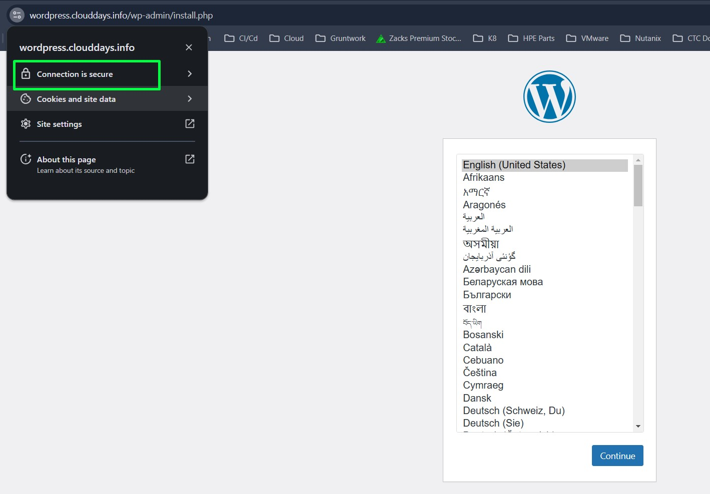
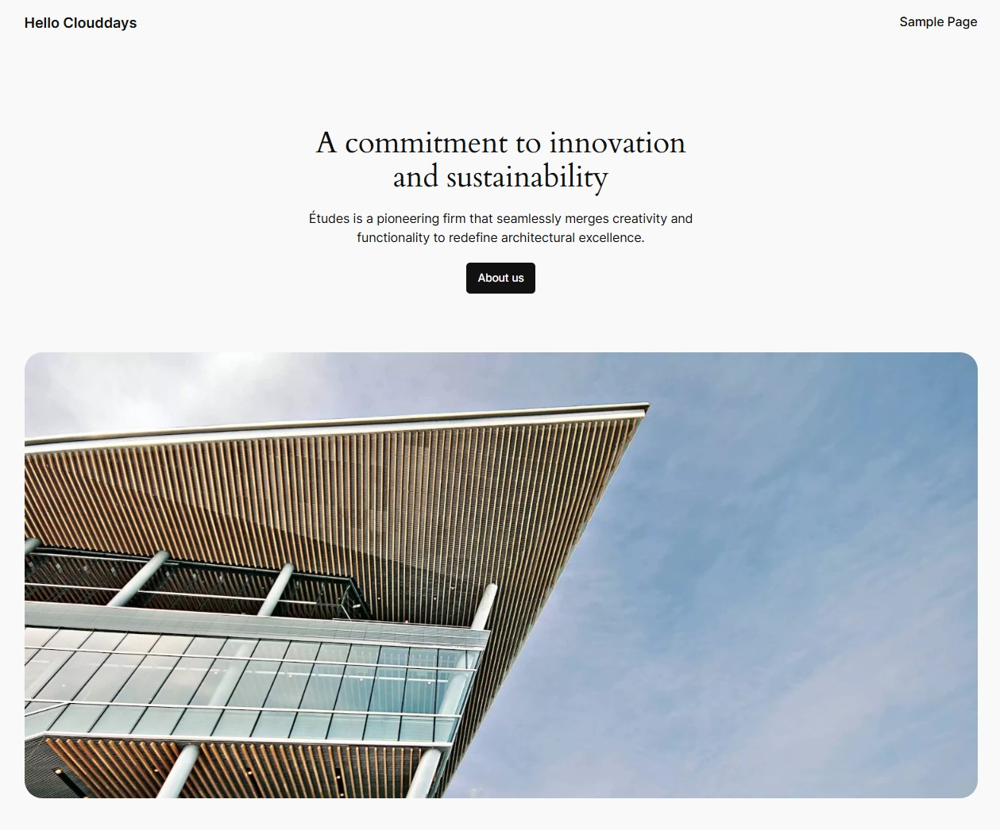

# Docker101-wordpress
Run your wordpress TLS letencrypt site in 5mins 

## Creating Cloud VM with Public IP Address 
```
az vm create \
  --resource-group RG001 --name wordpress_vm \
  --image UbuntuLTS --size Standard_B2s \
  --admin-username azureuser --admin-password <your-password> \
  --public-ip-sku Standard --authentication-type password \
  --generate-ssh-keys


az vm show \
  --resource-group RG001 --name wordpress_vm \
  --show-details --query "publicIps" \
  --output tsv
```
I jsut create in Azure Cloud, you can create anywhere in any public cloud providers.

## Create A record for your webpage in your public dns server. 

Grab the VM public IP and create A record.

## SSH into your VM


## Configuraiton 

```
# Create directory
mkdir wordpress

# Clone Git Repo
git clone https://github.com/Clouddays-tech/docker101-wordpress.git

# CD into directory
cd docker101-wordpress/

# Run Script
sudo bash init-letencrypt.sh
```
Fill in the SQL USER and SQL Password and your domain name (FQDN) for certificate request.



The TLS certificate is successfully generated from letsencrypt.




Once the script processing is completed check it out running containers `docker ps` and BOOM! your webpage is UP and Running. 





